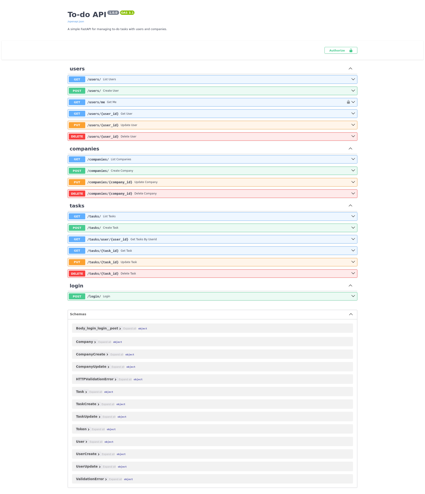

# Todo App with FastAPI

A comprehensive todo application built with FastAPI featuring user authentication, company management, and task organization.

## Assignment Progress


## Technologies Used

- **FastAPI** - Modern web framework for building APIs
- **SQLAlchemy** - SQL toolkit and ORM
- **SQLite** - Lightweight database
- **Pydantic** - Data validation using Python type annotations
- **Uvicorn** - ASGI server
- **Passlib** - Password hashing library with bcrypt
- **Python-JOSE** - JWT token handling
- **Alembic** - Database migration tool

## Features Implemented

- ✅ FastAPI application with automatic API documentation
- ✅ Pydantic models for data validation
- ✅ SQLite database with SQLAlchemy ORM
- ✅ Complete CRUD operations for tasks, users, and companies
- ✅ Database migrations with Alembic
- ✅ Password hashing with bcrypt
- ✅ JWT-based authentication with OAuth2
- ✅ User registration and login system
- ✅ Company-based user organization
- ✅ Protected endpoints with authentication
- ⬜ Authorization for users to access only their own todos
- ⬜ Role-based access control
- ⬜ Task sharing between users
- ⬜ Task categories and tags

## API Endpoints

### Authentication

- `POST /login/` - User login (returns JWT token)

### Users

- `POST /users/` - Create new user
- `GET /users/` - List all users
- `GET /users/me` - Get current user profile
- `GET /users/{user_id}` - Get user by ID
- `PUT /users/{user_id}` - Update user
- `DELETE /users/{user_id}` - Delete user

### Tasks

- `POST /tasks/` - Create new task
- `GET /tasks/` - List all tasks
- `GET /tasks/{task_id}` - Get task by ID
- `GET /tasks/user/{user_id}` - Get tasks by user ID
- `PUT /tasks/{task_id}` - Update task
- `DELETE /tasks/{task_id}` - Delete task

### Companies

- `POST /companies/` - Create new company
- `GET /companies/` - List all companies
- `GET /companies/{company_id}` - Get company by ID
- `PUT /companies/{company_id}` - Update company
- `DELETE /companies/{company_id}` - Delete company



The application provides interactive API documentation via Swagger UI at `/docs` endpoint when running locally.

## Installation & Setup

1. **Clone the repository**

   ```bash
   cd todo-app
   ```

2. **Create virtual environment**

   ```bash
   python -m venv venv
   source venv/bin/activate  # On Windows: venv\Scripts\activate
   ```

3. **Install dependencies**

   ```bash
   pip install -r requirements.txt
   ```

4. **Run database migrations**

   ```bash
   alembic upgrade head
   ```

5. **Start the application**

   ```bash
   uvicorn main:app --reload
   ```

6. **Access the API**
   - API Documentation: <http://localhost:8000/docs>
   - Alternative docs: <http://localhost:8000/redoc>
   - OpenAPI JSON: <http://localhost:8000/openapi.json>

## Usage Examples

### 1. Create a Company

```bash
curl -X POST "http://localhost:8000/companies/" \
     -H "Content-Type: application/json" \
     -d '{"name": "Tech Corp", "description": "Technology company"}'
```

### 2. Register a User

```bash
curl -X POST "http://localhost:8000/users/" \
     -H "Content-Type: application/json" \
     -d '{
       "username": "john_doe",
       "email": "john@example.com",
       "password": "securepassword",
       "first_name": "John",
       "last_name": "Doe",
       "company_id": 1
     }'
```

### 3. Login

```bash
curl -X POST "http://localhost:8000/login/" \
     -H "Content-Type: application/x-www-form-urlencoded" \
     -d "username=john_doe&password=securepassword"
```

### 4. Create a Task (with authentication)

```bash
curl -X POST "http://localhost:8000/tasks/" \
     -H "Content-Type: application/json" \
     -H "Authorization: Bearer YOUR_JWT_TOKEN" \
     -d '{
       "title": "Complete project",
       "description": "Finish the todo app",
       "completed": false,
       "user_id": 1
     }'
```
