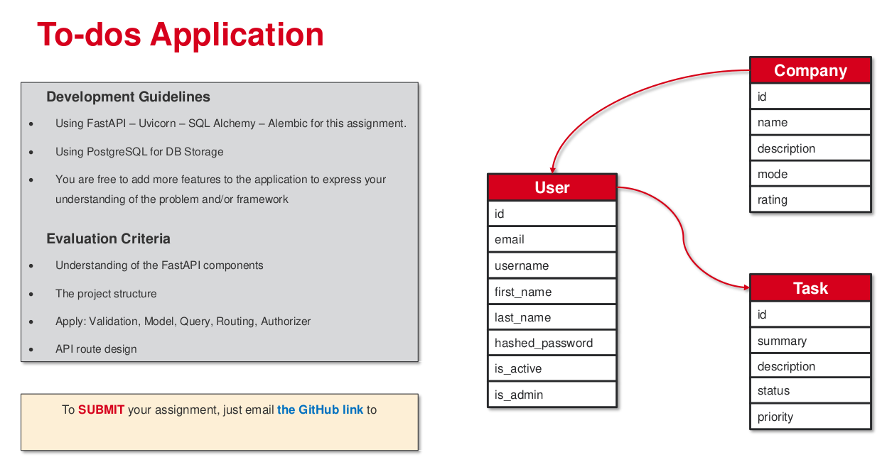

# Todo App with FastAPI

Technologies used: FastAPI, Pydantic, Uvicorn, SQLAlchemy, SQLite

## Assignment

To do list:

- ✅ Create a FastAPI application
- ✅ Create a Pydantic model for the todo item
- ✅ Set up a SQLite database using SQLAlchemy
- ✅ Implement CRUD operations for the todo items
- ✅ Test the API using Swagger UI
- ✅ Implement Alembic for database migrations
- ✅ Hash passwords for user authentication
- ⬜ Implement user authentication using OAuth2 and JWT
- ⬜ Autorization for users to access their own todos
- ⬜ ....
